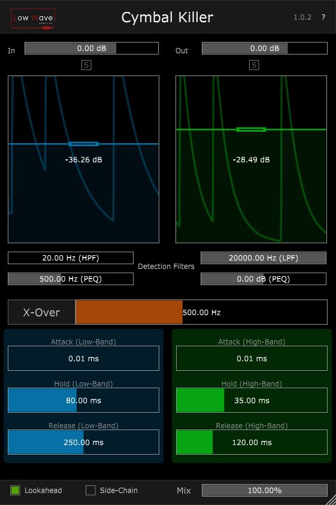

# Cymbal Killer
2-band Drum Gate

Cymbal Killer is a 2-band Gate especially designed for drums. 
With it's two bands you can have different envelope settings for the sustain (low frequencies) and attack (high frequencies) of the drum.
It allows the sustain to breathe while keeping the attack short to kill the cymbal bleed entering through the close mics on a drumset (hence the name).

- It has a side-chain input and high-pass, low-pass and parametric filters (shared by the two bands) for focusing the sound of the drum on the detector circuit;
- Lookahead for allowing the full transient through (introduces latency);
- Two visualizers (one for each band) for watching the envelope;
- Mix slider for allowing a mix between the original clean signal and the gated signal;

Made using the JUCE framework

Changelog:
- 1.0.2 - Added parametric filter on sidechain circuit;
- 1.0.1 - Fixed strange behaviour on sidechain filters;
- 1.0.0 - Fixed strange behaviour of channel input/output count when adding sidechain in DAW;
          Added version numbering on GUI.

